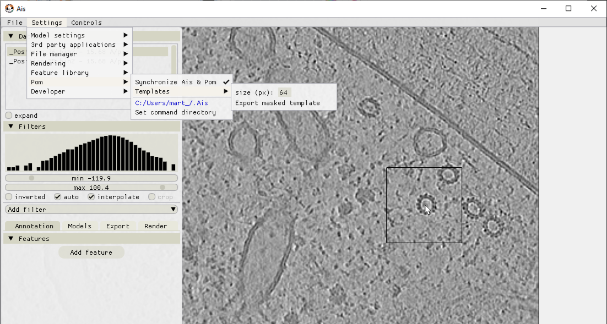
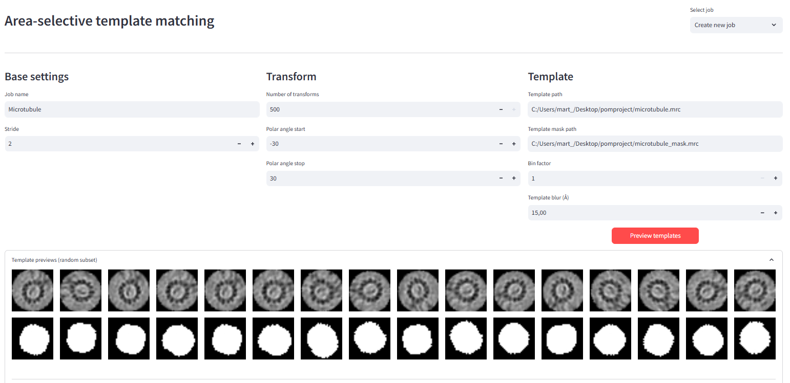
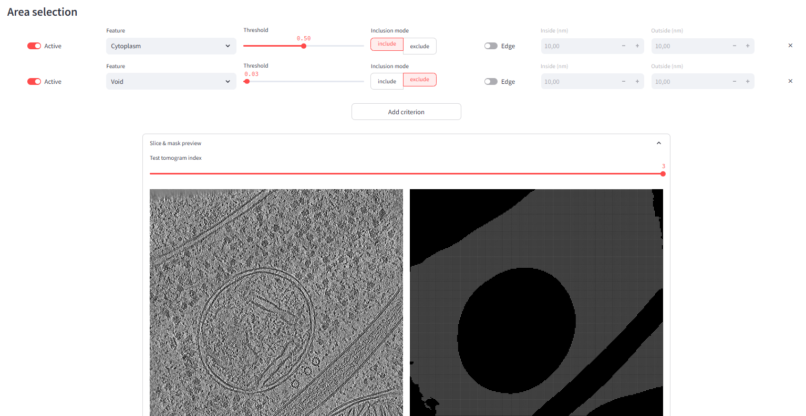
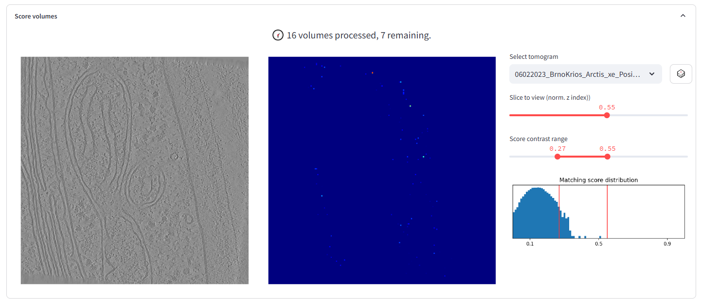
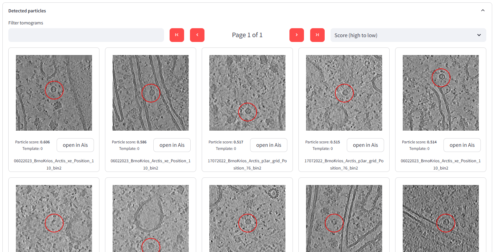

Area-selective template matching
__________

The Pom browser also offers functionality to set up area-selective template matching (ASTM) jobs.

Extracting a template in Ais
^^^^
Any .mrc can be used as a template (e.g. download a map from EMDB). It can also be useful to extract a template from your own data. To do so, open the tomogram of interest in Ais and set the desired template size via Settings -> Pom -> Templates -> size (px)

Next, hold both CTRL and SHIFT to set the cursor to template-extraction mode, select the area you want to extract, and click the left mouse button.

The extracted subtomogram is automatically opened in Ais and assigned an annotation feature named 'Template mask'. Manually annotate which parts of the volume are the particle of interest. When done,

Save the template and template mask via Settings -> Pom -> Templates - Export masked template

Setting up an ASTM job using the Pom browser
^^^^
Run:

::

  pom browse

And go to the 'Template matching' tab to set up a new job. Here you can define a title for the job and select which files to use as the template and template mask, as well as define the search parameters. When done, click 'preview templates' to see what the resulting template projections look like.

Next, set up the area-selection criteria. In the example below, we've defined masks that included the Cytoplasm (thresholded at 0.5) and additionally that avoid areas with a Void segmentation value > 0.1.

Scroll down and save the job configuration by pressing 'Save job'. This creates a directory .../astm/job_name in your Pom root directory.

At the top of the ASTM page in the Pom browser, use the 'Select job' dropdown menu to open the page for your new job.

Run the job using:

::

   pom astm run -c <job_name>

The resulting template matching score volumes and indices will be saved to root/astm/job_name/

Then convert the score volumes into coordinates with:

::

   pom astm pick -c <job_name> -threshold <threshold> -spacing-px <minimum particle spacing in pixel units> -p <number of parallel processes to run, e.g. 16>

The Pom browser template matching job page will automatically keep up to date with the progress of the job. You can inspect the resulting score volumes and particle picks there. The 'Score volumes' tab displays the job progress and can be used to inspect the results for the completed volumes:

And in the 'Detected particle' tabs you can see the picked particles. If the Pom browser is running locally (from the root directory of the project), the 'open in Ais' button can be used to open the corresponding tomogram in Ais and set it to the slice in which the particle was located. In the example below we targeted TRiC particles - the match with the highest score was in fact the instance that was used as the tempalte.

