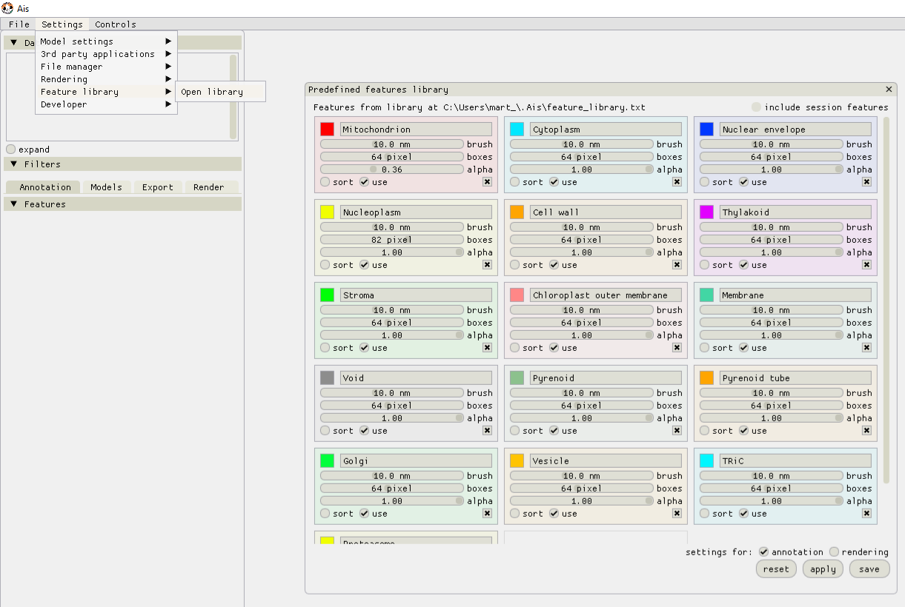
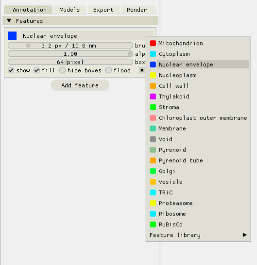

Organelle segmentation
__________

The first step in the workflow is to segment macromolecules. Although this can be done with various tools, we used Ais and refer to the `Ais documentation <https://ais-cryoet.readthedocs.io/en/latest/>`_ for further information. In the following, we will assume that the selected set of macromolecule segmentations (as defined in the project configuration) is already available in the macromolecule directory (also as defined in the project configuration).

The next step is then to train neural networks that output one of the selected organelles. To prepare the training data for these networks we also use Ais.

Feature library
^^^^^^^^^^^^
To organise the annotation of many different features one can use the new 'Feature Library' that is included in Ais since version 1.0.40. In the top menu bar, go to 'Settings' -> 'Feature library' -> 'Open library'. It is convenient to define feature presets in this library, to help organize the annotation.

After setting up the feature library, these presets can be used by right-clicking the title of an annotation and selecting the desired feature in the drop down menu.

Single-feature networks
^^^^^^^^^^^^
To begin preparing the training data, open any number of tomograms in Ais and start annotating the various features and adding boxes in the same way as you would in Ais when preparing training data for use in Ais itself. It is best to sample multiple different tomograms for training data, rather than prepare many annotations in a single tomogram. After adding some annotations to any one volume, save the annotated tomogram (ctrl + S, or via the top menu bar). Save the annotated tomograms in the project's tomogram folder to ensure that Pom can find them (quick saving an annotated tomogram with 'ctrl + S' saves the file in the same directory that the input .mrc is in).

Once you're happy with the annotations and ready to try a first iteration of the segmentation, run the following command in the Pom project directory:

::

   pom single initialize

This will loop over all annotated tomograms (.scns files) in the tomogram directory and sample the training data for the various features. Then prepare the single-feature networks:

::

   pom single train -o "Cytoplasm" -gpus 0,1,2,3
   pom single train -o "Mitochondrion" -gpus 0,1,2,3
   pom single train -o "Nuclear envelope" -gpus 0,1,2,3
   etc.

The relevant parameters in the project configuration for this step are:

::

   "z_sum": 4,
   "single_model_epochs": 100,               # the number of epochs (iterations over the full training dataset) to use
   "single_model_batch_size": 32,            # batch size to use during training

During processing, input volumes are filtered along the z-axis by convolution with a window function. The "z_sum" value is radius of this window (i.e. the window will be 2 * z + 1 voxels). This filter is also applied during the initialization of the training data.

To test the resulting networks, save at least one tomogram in the test directory and run the following commands:

::

   pom single test -o "Cytoplasm"
   pom single test -o "Mitochondrion"
   pom single test -o "Nuclear envelope"
   etc.

Joint network
^^^^^^^^^^^^
When the single-feature networks are ready, the next step is to train a single networks that can segment all features at once. Again, initialize the training data first:

::

   pom shared initialize -selective 1

This can take a while, as Pom will now apply each of the single-feature networks to all of the single-feature training datasets. The '--selective' argument specified whether to use either the full training datasets (--selective 0), or only those images in the training datasets where at least one pixel in the annotation is nonzero (--selective 1). If your input annotations contain a lot of unannotated images, using --selective 1 can lead to better results.

Next,

::

   pom shared train -gpus 0,1,2,3,4,5,6,7,8

The relevant parameters in the project configuration for this step are:

::

   "shared_model_epochs": 200,               # the number of epochs (iterations over the full training dataset) to use
   "shared_model_batch_size": 64,            # batch size to use during training

If the '-gpus' argument is not included, Pom will use the value specified in the project configuration instead.

Once training has completed, apply the network using:

::

   pom shared process

This last command can be used concurrently on multiple servers. Pom will automatically distribute the workload.